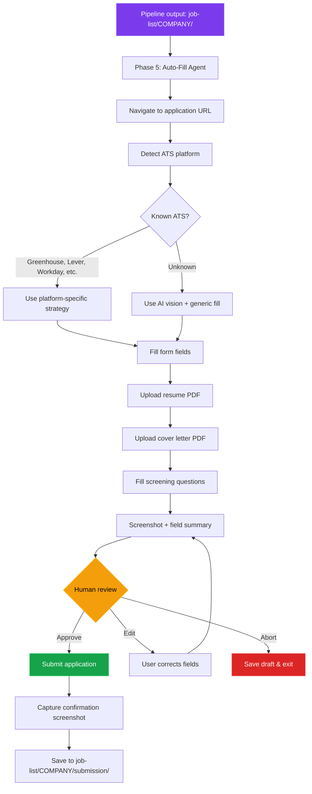
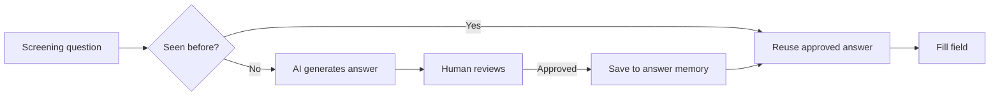
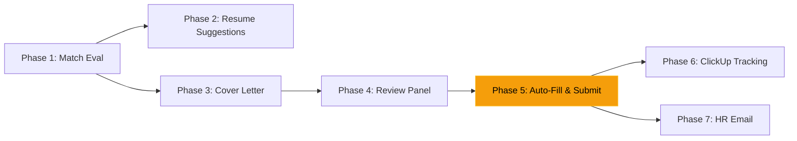

# Auto Job Application Fill

> Status: Planning
> Created: 2026-03-08
> Priority: High
> Depends on: job-application-pipeline

## Overview

Browser automation layer that takes the artifacts produced by the `/apply` pipeline (resume PDF, cover letter PDF, job analysis) and fills out career portal application forms automatically. Uses AI-augmented browser automation with a mandatory human approval checkpoint before final submission.

## Tool Evaluation

Research evaluated seven tools across two categories: **developer-controlled automation** and **ready-made products**.

### Shortlisted Tools

| Tool | Type | Strengths | Weaknesses |
|------|------|-----------|------------|
| **Browserbase Stagehand** | AI + Playwright SDK | Official form-filling templates, durable selectors via LLM, deterministic submit control | Hosted service dependency, cost per session |
| **browser-use** | Agent layer on Playwright | Open-source, hackable, built-in human-in-the-loop tools, MCP server | Newer project, less battle-tested |
| **Skyvern** | API-first AI automation | Vision-based (no selectors), works on any site, API-driven | Hosted service, less control over flow |
| **OpenAI / Claude computer use** | Raw computer use APIs | Full control, custom orchestration | Must build everything yourself, screenshot-based latency |

### Rejected Options

| Tool | Reason |
|------|--------|
| JobCopilot | Productized, no developer API, no custom pipeline integration |
| Simplify Copilot | Autofill only, no programmatic control |

## Recommended Architecture

**Primary stack:** Playwright + browser-use (agent layer) + human approval gate.



## Answer Memory

Screening questions repeat across applications. An answer memory stores previously approved answers for reuse.



### Answer Store Structure

```
job-list/
  .answer-memory.json       # shared answer memory
```

```json
{
  "answers": [
    {
      "question_pattern": "years of experience with React",
      "answer": "5+",
      "field_type": "text",
      "approved": true,
      "last_used": "2026-03-08"
    },
    {
      "question_pattern": "authorized to work in",
      "answer": "Yes",
      "field_type": "radio",
      "approved": true,
      "last_used": "2026-03-08"
    },
    {
      "question_pattern": "salary expectations",
      "answer": "Open to discussion based on total compensation",
      "field_type": "text",
      "approved": true,
      "last_used": "2026-03-08"
    }
  ]
}
```

## ATS Platform Detection

Common ATS platforms have predictable DOM structures. Detecting the platform allows targeted fill strategies.

| ATS Platform | Detection Signal | Market Share |
|-------------|-----------------|--------------|
| Greenhouse | `boards.greenhouse.io`, `#app_body` | High |
| Lever | `jobs.lever.co`, `.posting-` classes | High |
| Workday | `myworkdayjobs.com`, `#wd-` prefixes | High |
| Ashby | `jobs.ashbyhq.com` | Medium |
| BambooHR | `*.bamboohr.com/careers` | Medium |
| iCIMS | `careers-*.icims.com` | Medium |
| Custom | Fallback to AI vision | — |

## Field Mapping

The agent maps known data to form fields using a combination of label matching and AI reasoning.

### Profile Data Source

Pull from existing resume `.tex` files and a profile config:

```
job-list/
  .profile.json             # static profile data for form filling
```

```json
{
  "first_name": "",
  "last_name": "",
  "email": "",
  "phone": "",
  "linkedin_url": "",
  "github_url": "",
  "portfolio_url": "",
  "location": "",
  "work_authorization": "",
  "requires_sponsorship": false
}
```

### Field Priority

| Priority | Fields | Strategy |
|----------|--------|----------|
| Deterministic | Name, email, phone, LinkedIn, URLs | Direct fill from profile |
| Deterministic | Resume upload, cover letter upload | File upload from `job-list/COMPANY/` |
| AI-assisted | Work experience, education (if free-form) | Extract from resume `.tex` |
| AI-assisted | Screening questions | Answer memory → AI generation → human review |
| Human-only | Salary, visa/sponsorship, demographic (EEO) | Always require human confirmation |

## Submission Artifacts

```
job-list/
  COMPANY_NAME/
    submission/
      pre-submit-screenshot.png    # screenshot before submit
      confirmation-screenshot.png  # screenshot after submit
      filled-fields.json           # all field values as submitted
      submission-log.md            # timestamp, URL, status, notes
```

## Integration with Existing Pipeline

This becomes **Phase 5** of the job application pipeline:



### Skill Extension

```bash
# Full pipeline including auto-fill
/apply <job-posting-url> --auto-fill

# Auto-fill only (artifacts already exist)
/fill <company-name>

# Fill without submitting (dry run)
/fill <company-name> --dry-run
```

## Implementation Phases

### Phase A: Foundation (MVP)

1. Set up Playwright + browser-use in project
2. Implement `.profile.json` loader
3. Build Greenhouse-specific fill strategy (most common)
4. Implement human approval gate (terminal-based)
5. Screenshot capture before/after submit
6. Basic answer memory (JSON file)

### Phase B: Multi-ATS Support

1. Add Lever, Workday, Ashby strategies
2. AI fallback for unknown ATS platforms
3. Fuzzy question matching for answer memory
4. File upload handling across platforms

### Phase C: Polish

1. Integrate with `/apply` pipeline as Phase 5
2. ClickUp status update on successful submission
3. Batch fill mode (multiple applications in queue)
4. Answer memory analytics (coverage, reuse rate)

## Technical Requirements

- Node.js or Python runtime for Playwright
- `playwright` + `browser-use` packages
- Browser binary (Chromium, managed by Playwright)
- `.profile.json` populated by user
- Artifacts from `/apply` pipeline in `job-list/COMPANY/`

## Risk Mitigation

| Risk | Mitigation |
|------|-----------|
| CAPTCHA / anti-bot | Human-in-the-loop resolves manually; avoid headless mode |
| ATS DOM changes | AI fallback via browser-use; platform strategies are advisory, not required |
| Wrong field values | Mandatory screenshot review before submit |
| Rate limiting | Minimum 30s delay between applications; no rapid-fire |
| Sensitive fields (salary, EEO) | Always flagged for human input, never auto-filled |
| Application errors | Capture error screenshots; save state for retry |

## Open Questions

- [ ] Python or Node.js for the automation runtime?
- [ ] Use Browserbase (hosted) or local Playwright?
- [ ] Store browser session/cookies for multi-step applications?
- [ ] Support OAuth login (Google/LinkedIn SSO) on career portals?
- [ ] Integrate answer memory with Gemini for smarter question matching?
- [ ] Terminal UI or browser overlay for the human review step?
