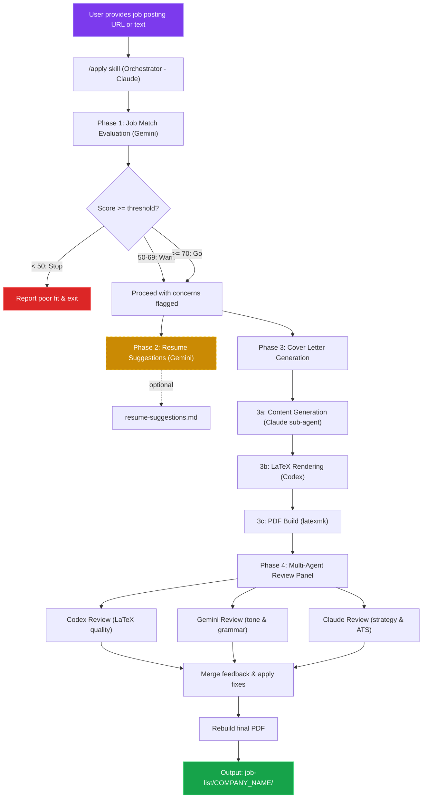
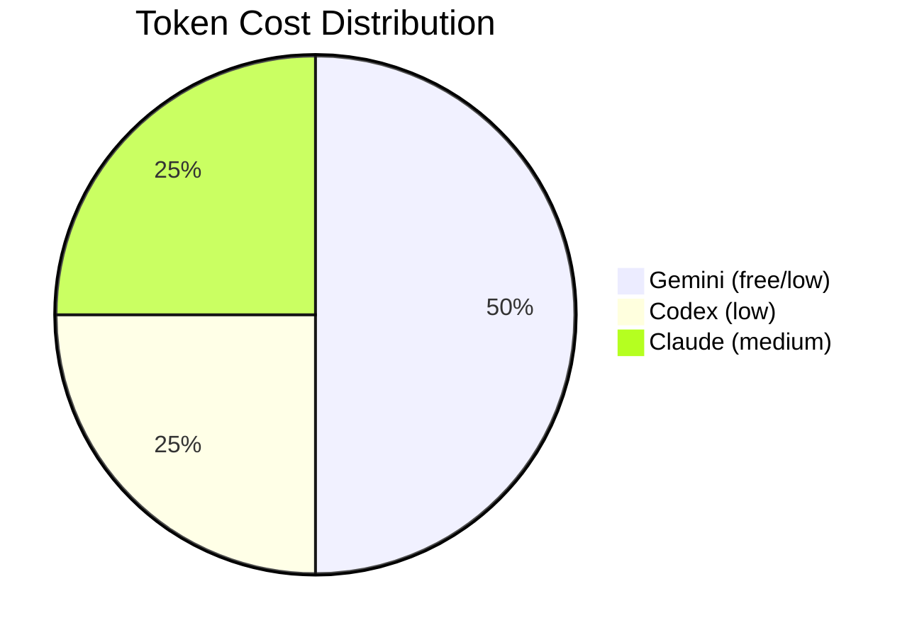

# Job Application Pipeline

> Status: Planning
> Created: 2026-03-07
> Priority: High

## Overview

End-to-end automated job application pipeline that orchestrates multiple AI agents (Claude, Gemini, Codex) to evaluate job fit, generate tailored cover letters, suggest resume improvements, and produce review-backed artifacts — all stored per-company under `job-list/`.

## Architecture



### Agent Distribution



## Output Structure

```
job-list/
  COMPANY_NAME/
    job-posting.md          # raw job posting (saved for reference)
    job-analysis.md         # full job analysis report (see template below)
    resume-suggestions.md   # optional: tailored resume change suggestions
    coverletter.tex         # generated cover letter source (default variant)
    coverletter.pdf         # built cover letter PDF
    reviews/
      codex-review.md       # LaTeX quality + formatting review
      gemini-review.md      # tone, grammar, cultural fit review
      claude-review.md      # strategic alignment + impact review
```

### Job Analysis Report Template (`job-analysis.md`)

The report is the primary artifact from Phase 1. It follows this structure:

```markdown
# {Company} — {Role Title} Analysis

## Match Summary
- **Score:** {0-100}
- **Verdict:** {Strong Match | Moderate Match | Poor Fit}

## Evaluation Metrics

| Metric               | Rating  | Evidence                              |
| -------------------- | ------- | ------------------------------------- |
| Domain Overlap       | Strong  | {resume snippet → JD requirement}     |
| Technical Stack      | Strong  | {resume snippet → JD requirement}     |
| Responsibility Level | Strong  | {resume snippet → JD requirement}     |
| Impact Evidence      | Partial | {resume snippet → JD requirement}     |
| Cultural/Soft Skills | Strong  | {resume snippet → JD requirement}     |

## Top Reasons for Match
1. {Reason with evidence from both resume and JD}
2. ...

## Job-to-Resume Mapping

| Job Requirement          | Resume Evidence                    | Strength | Fix Needed          |
| ------------------------ | ---------------------------------- | -------- | ------------------- |
| {requirement from JD}    | {matching bullet/skill from resume}| Strong   | No change needed.   |
| ...                      | ...                                | Partial  | {specific edit}     |

## Selling Points & Keyword Plan

### Selling Points
- {Differentiator relevant to this role}
- ...

### Keyword Plan
- **Must-Have:** {keywords extracted from JD}
- **Important Phrases:** {secondary terms}

## Resume Edits

### Absolutely Necessary
- **Where:** {section/company}
- **What:** {change description}
- **Rewrite:** {new text}
- **Why:** {alignment rationale}

### ATS Keyword Pack
- **Missing Keywords:** {list}
- **Placement:** Summary: {keywords}; Skills: {keywords}; Experience: {keywords}

## Application Strategy

### Cover Letter Tone
- **Recommended:** {Formal | Conversational/Modern}
- **Rationale:** {why this tone fits the company culture}

### Outreach
- **Recruiter/Hiring Manager:** {recommended contact strategy}
- **Channel:** {LinkedIn message | Email | Company portal}
```

## Phase 1: Job Match Evaluation (Gemini Sub-Agent)

### Purpose
Evaluate job-resume fit before investing effort in cover letter generation.

### Agent Details
- **Runner:** Gemini CLI (headless mode)
- **Model:** `gemini-3.1-pro-preview` (latest Gemini 3.1 thinking/reasoning model)
- **Prompt:** [`docs/prompts/job-match-evaluation.prompt.md`](../prompts/job-match-evaluation.prompt.md)
- **Input:** Job posting text + current resume content (extracted from `.tex` files)
- **Output:** `job-analysis.md` — structured report (see template in Output Structure)

### Gemini CLI Invocation

```bash
# Headless mode with thinking model
gemini -m gemini-3.1-pro-preview \
  -p "$(cat docs/prompts/job-match-evaluation.prompt.md)" \
  -y \
  -o text \
  < <(echo -e "## Resume\n$(cat src/resume/*.tex)\n\n## Job Description\n$(cat job-list/COMPANY/job-posting.md)")
```

**Why thinking model:**
- The evaluation requires multi-step reasoning: parsing evidence, classifying requirements, scoring across 8 metrics, and applying gate logic.
- Gemini 3.1 Pro's built-in chain-of-thought produces more conservative, evidence-grounded scores vs. standard completion.
- Thinking is enabled by default — no extra flags needed. Thinking budget capped at 8192 tokens.

**CLI flags used:**
| Flag | Purpose |
|------|---------|
| `-m gemini-3.1-pro-preview` | Select the latest thinking/reasoning model |
| `-p` | Non-interactive (headless) mode |
| `-y` | Auto-approve tool use (no human prompts) |
| `-o text` | Plain text output (no formatting artifacts) |

### Evaluation Metrics

The prompt defines 8 evaluation metrics with weighted scoring (see full prompt file):

| Metric                         | Weight | Definition                                                                                       |
| ------------------------------ | -----: | ------------------------------------------------------------------------------------------------ |
| Domain Overlap                 | 15     | Similarity in product type or team mission                                                       |
| Technical Stack                | 20     | Direct and semantic match of required tools, languages, and frameworks                           |
| Responsibility Level           | 15     | Match between expected seniority/scope and candidate experience                                  |
| Impact Evidence                | 15     | Presence of measurable results for tasks similar to the role's requirements                      |
| Cultural/Soft Skills           | 5      | Alignment on mentorship, cross-team collaboration, and company values                            |
| Experience Alignment           | 15     | Relevance of past work history, title alignment, seniority progression                           |
| Education/Certification        | 5      | Alignment with required degrees, certifications, or formal qualifications                        |
| ATS/Keyword Alignment          | 10     | Presence of important JD terms — exact, semantic, and adjacent matches                           |

Each metric is rated as **Strong** (full weight), **Partial** (60%), or **Weak** (20%), with a final ±5 adjustment for edge cases.

### Gate Logic
- Score >= 70: proceed to cover letter + resume suggestions
- Score 50-69: proceed with warning, flag concerns
- Score < 50: stop, report why the role is a poor fit
- Hard blockers (work auth, location, mandatory certification) trigger an immediate stop regardless of score

## Phase 2: Resume Change Suggestions (Optional - Gemini Sub-Agent)

### Purpose
Identify specific resume improvements for this particular job posting.

### Agent Details
- **Runner:** Gemini CLI
- **Input:** Job posting + current resume `.tex` files + job match report
- **Output:** `resume-suggestions.md`

### Suggestion Categories
- Bullets to reword for better keyword alignment
- Skills to add or reorder
- Summary adjustments
- Section reordering recommendations
- Quantification opportunities

### Important
- Suggestions only — no automatic resume edits
- User reviews and applies changes manually via `/tailor`

## Phase 3: Cover Letter Generation (Required)

### Cover Letter Variants

The pipeline generates a single cover letter with a tone selected based on the target company:

| Variant               | Best For                                    | Characteristics                                                      |
| --------------------- | ------------------------------------------- | -------------------------------------------------------------------- |
| Conversational/Modern | Tech companies (Miro, Figma, Spotify)       | Enthusiasm for product, collaborative language, problem-solving focus |
| Formal                | Traditional industries (banking, insurance) | Structured, credential-focused, conservative tone                    |

The recommended variant is determined during Phase 1 analysis and recorded in `job-analysis.md` under "Application Strategy > Cover Letter Tone." The user can override the recommendation via a flag:

```bash
/apply <job-posting> --tone=formal
/apply <job-posting> --tone=conversational
```

### Sub-Step 3a: Content Generation (Claude Sub-Agent)
- **Runner:** Claude (sub-agent)
- **Input:** Job posting, resume content, job analysis report (including recommended tone), company research
- **Task:** Generate compelling cover letter content tailored to the role and tone variant
- **Output:** Structured content (opening, body paragraphs, closing)

### Sub-Step 3b: LaTeX Rendering (Codex Sub-Agent)
- **Runner:** Codex CLI
- **Input:** Content from 3a + existing `src/coverletter.tex` as template
- **Task:** Produce a properly formatted `.tex` file using the Awesome-CV class
- **Output:** `job-list/COMPANY_NAME/coverletter.tex`

### Sub-Step 3c: PDF Build
- **Runner:** Local `make` or `latexmk`
- **Task:** Compile the cover letter to PDF
- **Output:** `job-list/COMPANY_NAME/coverletter.pdf`

## Phase 4: Multi-Agent Review Panel

### Purpose
Three independent reviewers examine the cover letter from different angles, then fixes are applied.

### Reviewers

| Reviewer | Runner | Focus Area |
|----------|--------|------------|
| LaTeX Quality | Codex | Formatting, compilation, class compliance, visual consistency |
| Tone & Grammar | Gemini | Professional tone, grammar, cultural fit, readability |
| Strategic Alignment | Claude | Value proposition, keyword strategy, ATS optimization, persuasion |

### Review Process
1. All three reviews run in parallel
2. Results consolidated into `reviews/` folder
3. Claude orchestrator merges actionable feedback
4. Applies non-conflicting fixes to `coverletter.tex`
5. Rebuilds PDF
6. If conflicts exist, presents options to user

## Skill Definition

The pipeline will be invoked as a single skill:

```
/apply <job-posting-url-or-text>
```

### Skill Behavior
1. Parse job posting (fetch URL or accept pasted text)
2. Run job match evaluation
3. If match passes threshold:
   a. Generate resume suggestions (background)
   b. Generate cover letter (foreground)
   c. Run review panel on cover letter
   d. Apply reviews and rebuild
4. Present summary to user with links to all artifacts

## Token Optimization Strategy

| Step | Agent | Estimated Cost |
|------|-------|---------------|
| Job match eval | Gemini | Free/low |
| Resume suggestions | Gemini | Free/low |
| Content generation | Claude sub-agent | Medium |
| LaTeX rendering | Codex | Low |
| LaTeX review | Codex | Low |
| Tone review | Gemini | Free/low |
| Strategic review | Claude sub-agent | Medium |

**Total Claude tokens:** ~2 sub-agent calls (content gen + strategic review)
**Offloaded to free/cheap:** 4 out of 7 steps

## Dependencies

- Gemini CLI installed and authenticated
- Codex CLI installed and authenticated
- `latexmk` + XeLaTeX available for PDF builds
- Awesome-CV class (`awesome-cv.cls`) in project root

## Resolved Questions

- [x] **Threshold score configurable?** — Yes. Default thresholds (70/50) apply, but can be overridden: `/apply <job> --threshold=60`.
- [x] **Batch applications?** — Deferred. Single-job pipeline first; batch support is a future enhancement once the single flow is stable.
- [x] **Different resume formats?** — Handled via format detection in Phase 1. Three modes:
  - **Chronological (default):** Standard clean format with technical depth and impact metrics. Preferred by most tech companies.
  - **Functional:** Group skills by theme (Architecture, Mentorship) for career pivots. Triggered by `--format=functional`.
  - **Academic/CV:** Include publications, speaking engagements, extensive project lists. Triggered by `--format=cv`.
  The recommended format is noted in `job-analysis.md`. The user applies format changes manually via `/tailor`.
- [x] **Cover letter variants?** — Yes. A single cover letter is generated with a tone (conversational or formal) selected based on company culture analysis. See Phase 3 "Cover Letter Variants" for details and override flags.
