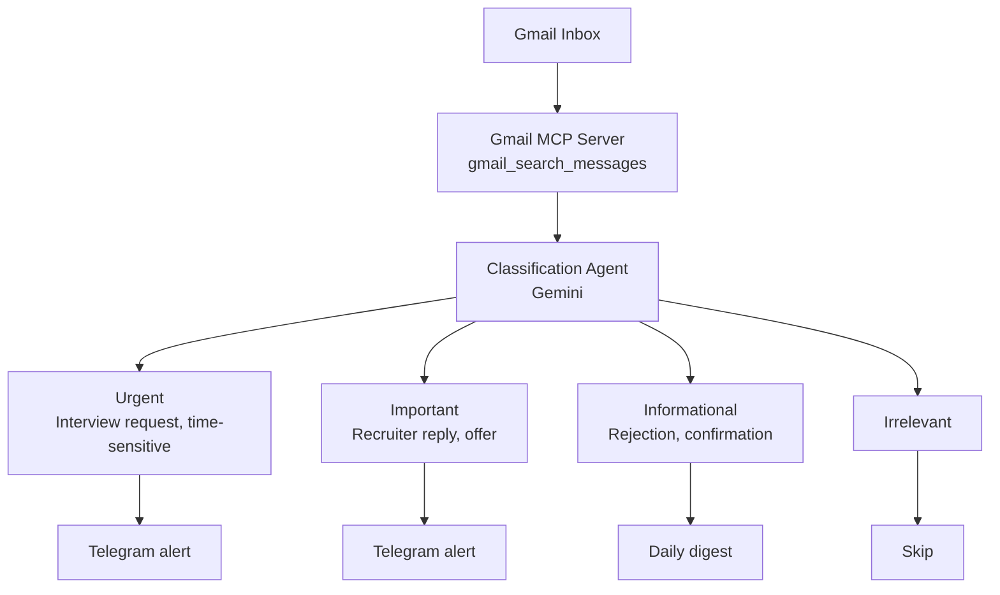

# Email Monitoring & Telegram Notifications

> Status: Future
> Created: 2026-03-07
> Priority: Medium
> Depends on: clickup-tracking (optional)

## Overview

Monitor Gmail inbox for job-application-related emails (interview invitations, recruiter responses, rejections, offers) and send real-time Telegram notifications for messages that need a quick reply.

## Architecture



## Gmail MCP Integration

### Available Tools
- `gmail_search_messages` - poll for new emails matching job-search queries
- `gmail_read_message` - read full email content for classification
- `gmail_read_thread` - read full thread for context

### Search Queries
```
# Recruiter / HR replies
from:(*@company1.com OR *@company2.com) newer_than:1d

# General job keywords
subject:(interview OR offer OR application OR position) newer_than:1d is:unread

# LinkedIn messages forwarded
from:messages-noreply@linkedin.com newer_than:1d
```

## Telegram Notification

### Options

1. **Telegram Bot API (direct)** - Simple HTTP POST to `https://api.telegram.org/bot{TOKEN}/sendMessage`
   - Lightweight, no MCP server needed
   - Can be called from a shell script or sub-agent

2. **Telegram MCP Server** - If one becomes available
   - Richer integration (buttons, inline replies)
   - Structured message formatting

### Message Format
```
[URGENT] Interview Request
Company: Acme Corp
From: jane@acme.com
Subject: Interview for Senior Frontend Developer
Received: 2026-03-07 14:30

Preview: "Hi Mahdi, we'd love to schedule..."

Reply needed within: ~24h
```

## Classification Agent

- **Runner:** Gemini (fast, cheap classification)
- **Input:** Email subject + sender + first 200 chars of body
- **Output:** Category (urgent / important / informational / irrelevant) + summary

### Classification Rules
| Category | Trigger Keywords/Patterns | Action |
|----------|--------------------------|--------|
| Urgent | "interview", "schedule", "call", "availability", time-bound language | Telegram immediately |
| Important | "offer", "next steps", "we'd like to", recruiter domain | Telegram immediately |
| Informational | "unfortunately", "not moving forward", "received your application" | Daily digest |
| Irrelevant | Newsletter, marketing, no-reply generic | Skip |

## Scheduling

### Option A: Cron-based polling
- Run a script every 15-30 minutes
- Uses Gmail MCP to check for new unread emails
- Classifies and notifies

### Option B: On-demand check
- A `/check-inbox` skill that runs the pipeline manually
- User triggers when they want to catch up

## Dependencies

- Gmail MCP server (already available in this project)
- Telegram Bot token (user needs to create via @BotFather)
- Telegram chat ID (user's personal chat or a dedicated channel)
- Gemini CLI for classification

## Open Questions

- [ ] Polling frequency: 15 min? 30 min? On-demand only?
- [ ] Should we auto-draft replies for common scenarios?
- [ ] Store email classification history for improving the classifier?
- [ ] Link notifications back to ClickUp tasks?
- [ ] Support for other messaging platforms (Slack, Discord)?
